# Operators Subtask And Stream Partitions

  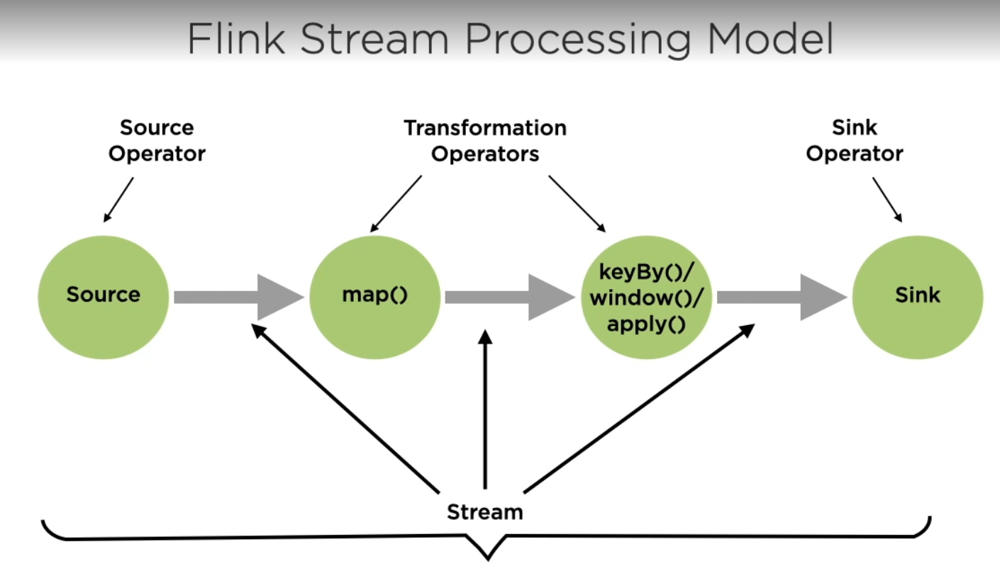

* Here is a big picture overview of how operators that you define make up a directed‑acyclic graph transforming your input stream till the final results are written out using a sink. 

* The input stream is read in using a source operator, and final results are written out using a sink operator. 
* In between the source and the sink, you can have multiple transformation operators which work on your data.

  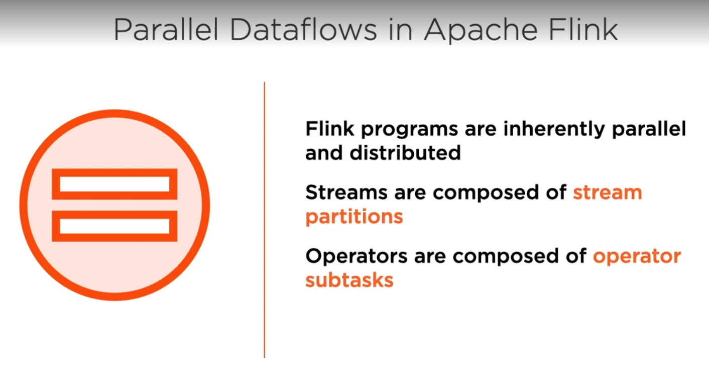

* Flink programs are inherently parallel and distributed, which means that the operators that operate on streaming dataflows are spread across multiple nodes in your Flink cluster. 

* Data transformations run on subsets of streaming data, which means the streams within your Flink applications are composed of stream partitions. 

* Any operator performing transformation can be composed of operator subtasks. 
* Stream partitions and operator subtasks together are responsible for the distributed and parallel execution of a Flink application.

  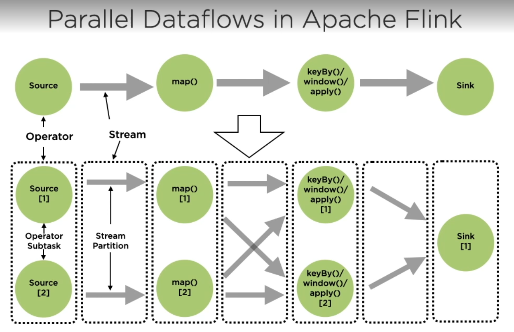
* At the very top here is the directed‑acyclic graph of your Flink application. 
* We read in data from the source, the source is an operator, and we write out data to a sink, and we perform a number of transformations on the data within the application. 
* Every node in this graph is an operator, and every edge in this graph is a stream. 
* The operators in your Flink application may be divided into operator subtasks that work on subsets of the input stream. 
* In this example here, the source operator is executed using two subtasks. 
* The source has a parallelism of 2. Every subtask will output results which form a stream. 
* These results are referred to as stream partitions because they are partitions of the original stream that we're working with. 
* The entities in each stream partition may then be forwarded along to other operators, which then operate on these stream partitions using operators subtasks. 
* As you can see, the map transformation here has two subtasks. 
* It has a parallelism of 2. Now, this continues. The remaining transformation, the keyBy window and apply, also runs with a parallelism of 2 till finally the output of the final operator is sent along to the sink operator, which writes it out to persistent storage somewhere.

  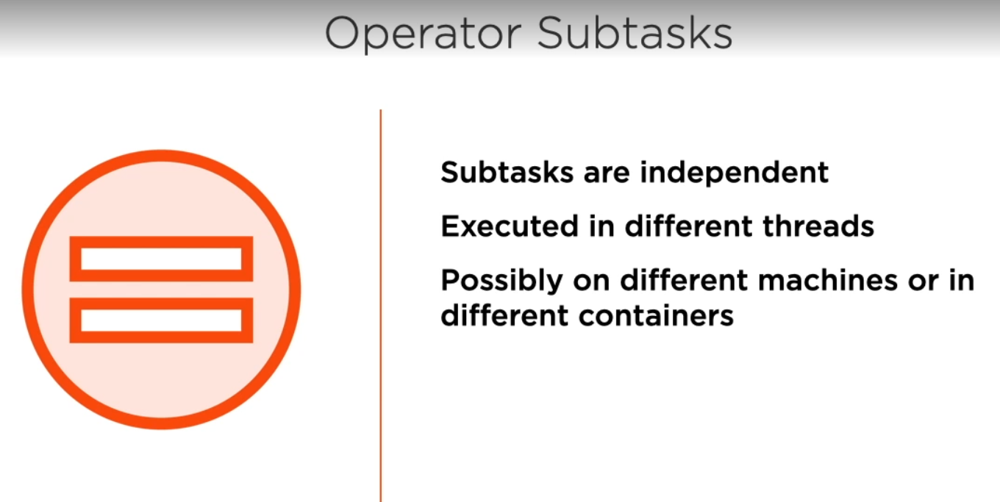
* Every operator can be split into subtasks to process your input stream, and these subtasks run completely independently of one another. * These subtasks may be executed in different threads. 
* It's also possible for these subtasks to run on different machines or on different containers within a cluster. 
* The parallel execution of your dataflow operations is possible because of these subtasks. 
* The number of subtasks refer to the parallelism of the individual operator.

  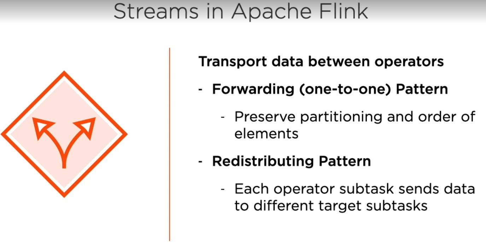
* Operators which make up the notes in our directed‑acyclic graph perform the actual transformation of input data. 
* The edges in our directed‑acyclic graph are responsible for transporting data between operators. 
* Edges are referred to as streams. 
* Now, transporting data between operators can be done in two ways. 
* You can have the forwarding pattern, which is a 1:1 pattern which preserves the partitioning and order of elements in the stream. 
* The elements in the stream partition are not shuffled or reordered but passed along as is. On the other hand, data can be transported using the redistributing pattern. 
* This is where every operator subtask sends data to different target subtasks. The original order of the data is not reserved.

  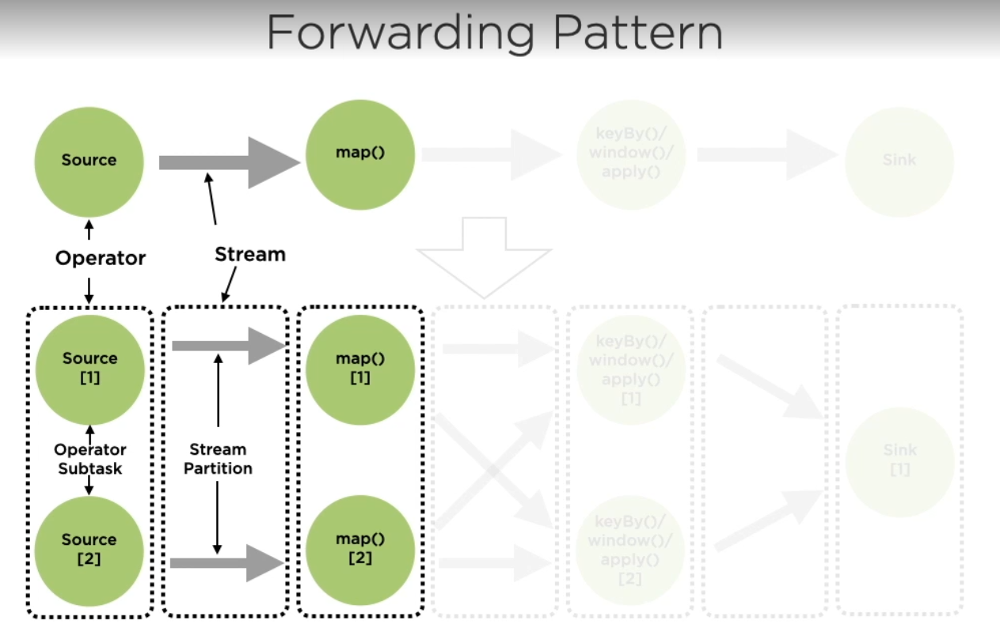
* If you look back at our example here, you can see the forwarding pattern in action. 
* The stream partitions that move data between the two operator subtasks for the source and the map operator subtask transport data using the forwarding pattern.

  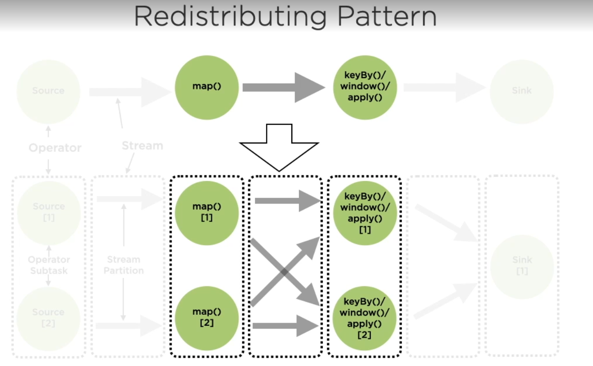
* On the other hand, when data is transported between the map operator subtask and the keyBy window subtask, you can see that the data is redistributed. 
* The original stream partitions have changed, which means one operator subtask can send data to several target subtasks. 
* This is the redistributing pattern in action.

# Stateless And Stateful Transformations

* Flink allows you to specify different kinds of data transformations on input streams. 
* The kind of processing that you perform on input data can be broadly divided into stateless transformations and stateful transformations. 

  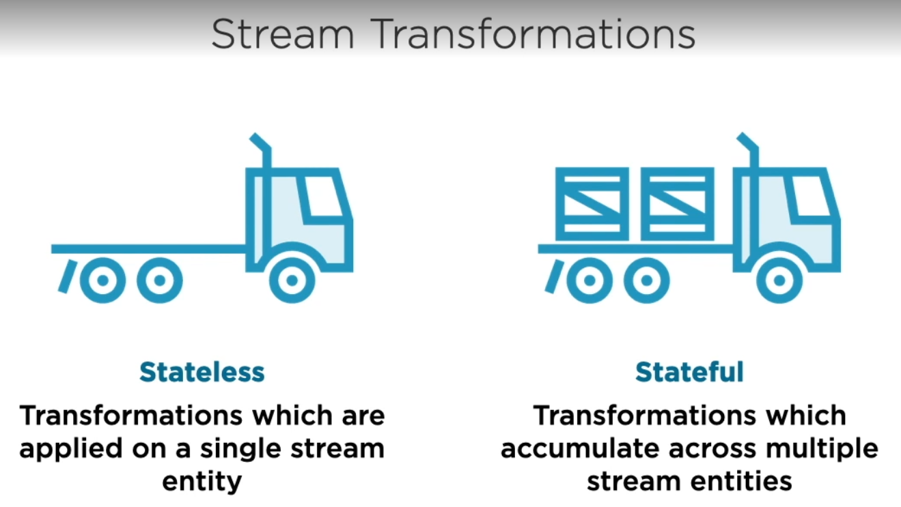

* Stateless transformations are those which are applied on a single streaming entity at a time. 
* The processing code for a stateless transformation looks at only one element in the input stream, it then acts on that single element to produce 0, 1, or more elements in the output stream. 
* On the other hand, stateful transformations are transformations which accumulate across multiple stream entities. 
* Stateful transformations don't operate on elements in isolation. 
* Instead, elements that have come previously in the stream, or are yet to arrive in the stream, may be included in the transform code. 

  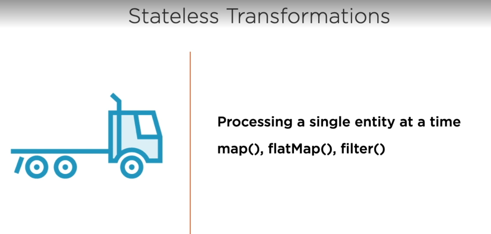

* Stateless transformations are easier to understand and work with because they involve processing only one entity at a time. 
* Examples of stateless transformations in Flink include the map operation, the flatMap, and the filter operation. 
* The map operation produces a transformed output for every input entity. 
* The flatMap may produce 0 or more output entities for every input entity. 
* And the filter operation will filter entities from the output stream using some condition that has been defined.

  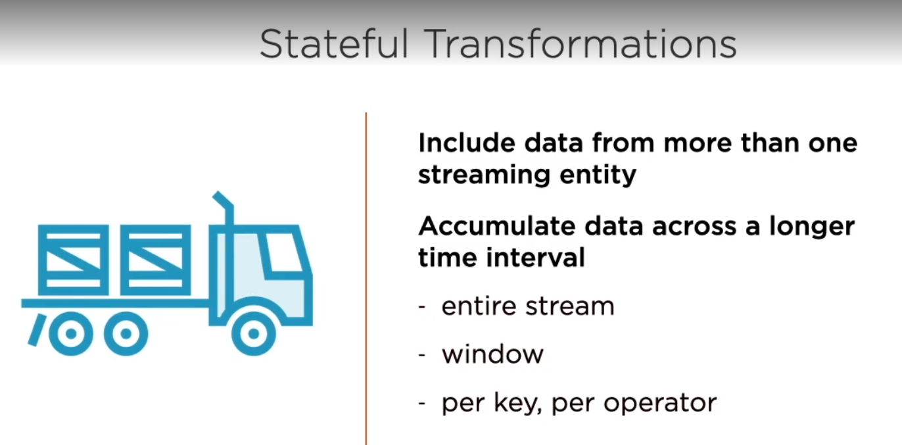

* Stateful transformations don't just look at one entity from the input stream, but they include data from more than one entity, either entities that have arrived earlier in the stream or entities that are yet to arrive in the stream. 
* Stateful operations thus involve accumulating data across a longer time interval. 
* This time interval can be the entire stream, a window of time within the stream, or this data can be accumulated per key or per operator. 
* Stateful transformations involve partitioning the stream in some way and then applying some kind of aggregation operation.

# Job Manager And Task Manager

  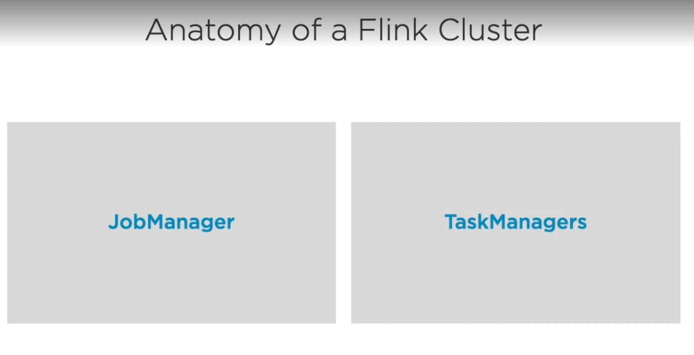

* There are two categories of processes running on a Flink cluster. 
* We have the Flink JobManager and you have one or more Flink TaskManagers. 
* The JobManager and TaskManagers can be started in a variety of different ways. 
* You can start them directly on machines which make up a standalone cluster, we can start them within Docker containers, or they can be managed by a resource framework such as Yarn or Mesos. 
* TaskManagers connect to JobManagers and announce themselves as available to be assigned work. 
* Let's talk about the JobManager in detail first to understand what exactly this process does.

  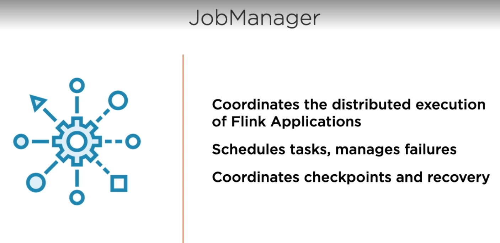

* The JobManager is responsible for coordinating the distributed execution of Flink applications. 
* The JobManager will work with the scheduler to schedule tasks and manage any failures that occur during your Flink job execution. 
* The JobManager is also responsible for coordinating checkpoints within your program to ensure that in the case of failures your program can recover from a previously checkpointed state.

  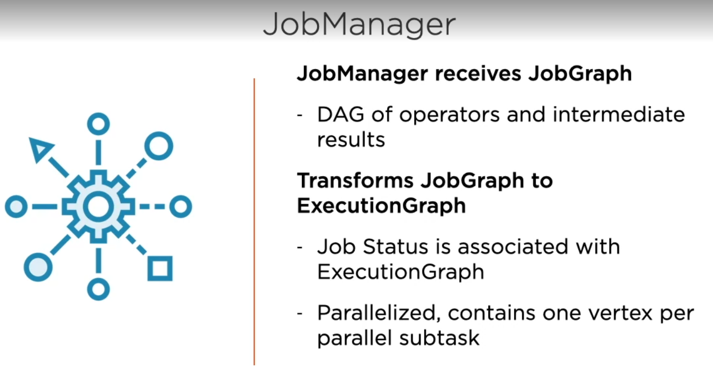

* The JobManager receives the JobGraph, which is the directed acycli graph of operators and streams which make up your processing pipeline. 
* The JobManager then transforms this JobGraph to an ExecutionGraph. 
* The difference between a JobGraph and an ExecutionGraph is that the ExecutionGraph is parallelized. 
* The ExecutionGraph is made up of the operator, subtask, and the stream partitions which actually run on the distributed cluster. 
* A JobStatus is also associated with an ExecutionGraph. The ExecutionGraph is parallelized, which means it contains one vertex per parallel subtask.

  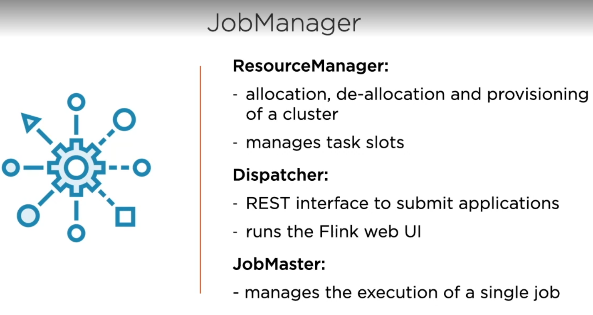

* The JobManager has three different components which it uses to perform its operations. 
* The ResourceManager is responsible for resource allocation and deallocation and provisioning of a cluster. 
* The ResourceManager assigns resources to individual jobs using task slots. 
* Task slots are the smallest unit of resource scheduling in a Flink cluster. 
* Flink implements multiple ResourceManagers for different environment. 
* There are resource providers for Yarn, Mesos, Kubernetes, and standalone deployments. 
* Another component that the JobManager has is the dispatcher, which provides a REST interface to submit Flink applications for execution and starts a new JobMaster for each submitted job. 
* The dispatcher is also responsible for running the Flink web UI, which you can use to monitor your applications submitted to Flink. And finally, we have the JobMaster component which manages the execution of a single job. When you submit multiple Flink applications to a cluster each will have its own JobMaster. 

  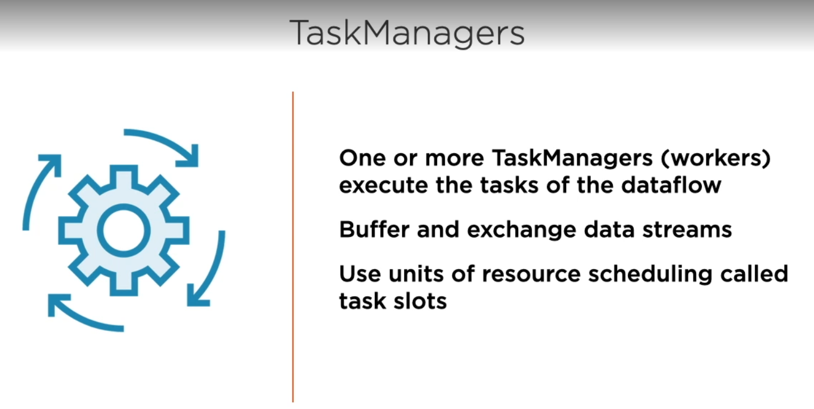

* Every Flink application will have at least one JobMaster
* It can have one or more TaskManagers
* TaskManagers are the workers which execute the tasks of your streaming data flow
* The actual operations defined by the operators in your processing code are executed by the TaskManager
* The TaskManager is also responsible for buffering and exchanging data streams between operators
* The TaskManager assigns tasks using units of resource scheduling called task slots
* Every TaskManager has access to some resources on the machine on which it executes
 
  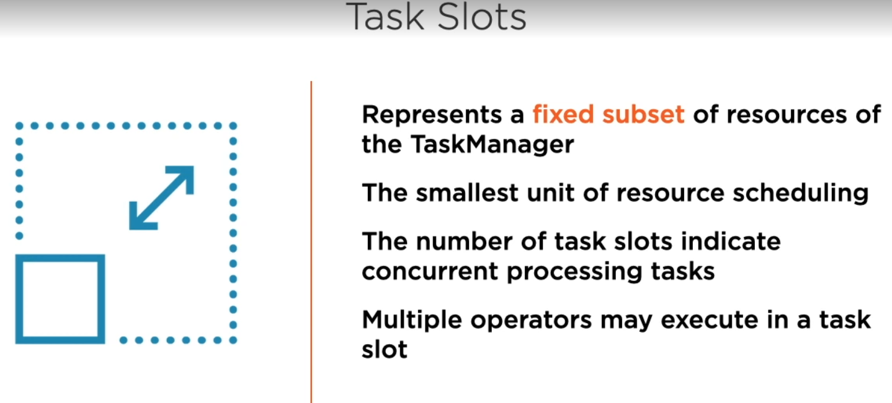

* A task slot represents a fixed subset of resources of the TaskManager
*  So a single TaskManager can be subdivided into multiple task slots, and a task slot is the smallest unit of resource scheduling in a Flink cluster
*  The number of task slots in a TaskManager indicates the number of concurrent processing tasks that can be executed by that TaskManager
*  Now it's possible for multiple operators to execute within the same task slot, so there is not a one‑is‑to‑one correspondence between a task slot and an operator
*  Let's visualize how TaskManagers and task slots work

  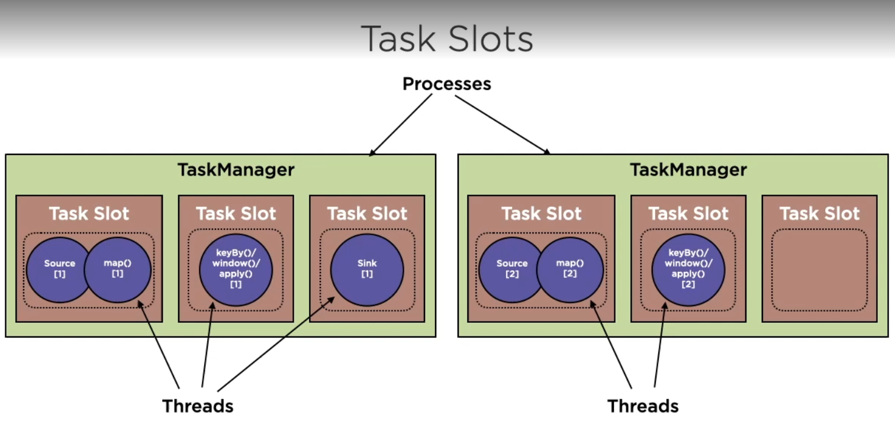

* Think of the TaskManager as executing processes which run your transformation code
*  Every TaskManager is divided into task slots, and task slots are run on different threads
*  The ExecutionGraph of your Flink application will contain operator subtasks and stream partitions where operator subtask other units of parallelism
*  Operator subtasks will be assigned to task slots within your TaskManager in order to make use of the resources within that task slot
*  Every task slot will have dedicated memory resources that are assigned to the operator that runs within that slot

  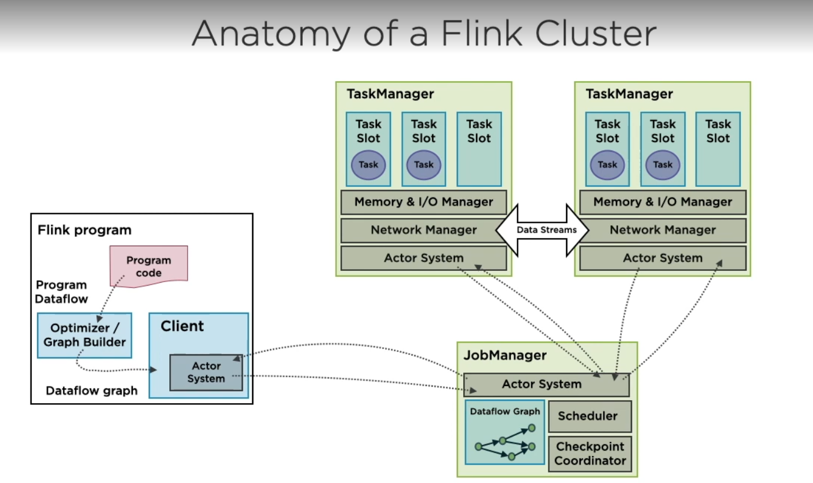

* Let's bring together everything that we've discussed so far and see the anatomy of a Flink cluster
* Here is a Flink cluster on three different machines
* One machine runs the JobManager
* We have two separate machines running TaskManagers
* The Flink client is not part of the runtime and program execution, but is used to prepare and send a data flow to the JobManager
* After that, the client can disconnect, which means it runs in detached mode, or it can stay connected to receive progress reports
* That is attached mode
* The JobManager receives the JobGraph, which it converts to an ExecutionGraph for parallelized data flow
* It then schedules the application on TaskManagers
* TaskManagers connect themselves to the JobManager in the cluster and make themselves available for the execution of processing code

# Task Lifecycle and Operator Lifecycle

  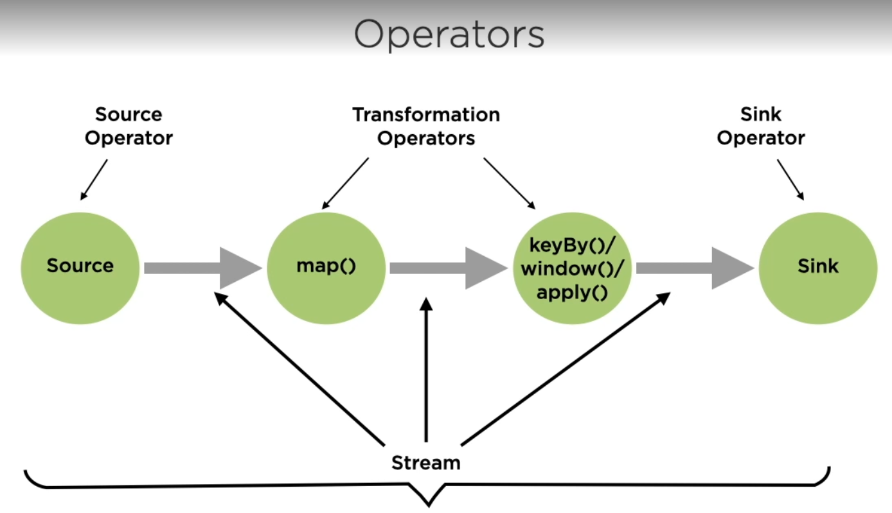

* We've seen that any Flink application can be considered to be a directed acyclic graph where operators act on streams. 
* This job graph depiction of a Flink application is converted to an execution graph where every vertex represents parallel execution. 
* Operators are made up of operator subtasks that perform processing in parallel. 
* Streams are subdivided into stream partitions, subsets of data flows. 

  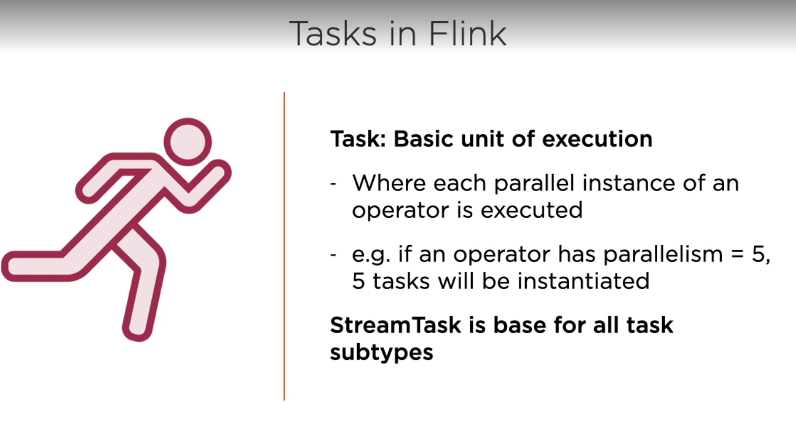
* A task in Flink is the basic unit of execution
* This task is run within a task slot
* A task can be thought of as a parallel instance of an operator that is executed to process your input data
* So if an operator has a parallelism equal to 5, five tasks will be instantiated and run within different task slots of the TaskManager
* The base task for all tasks executed in Flink is the StreamTask

  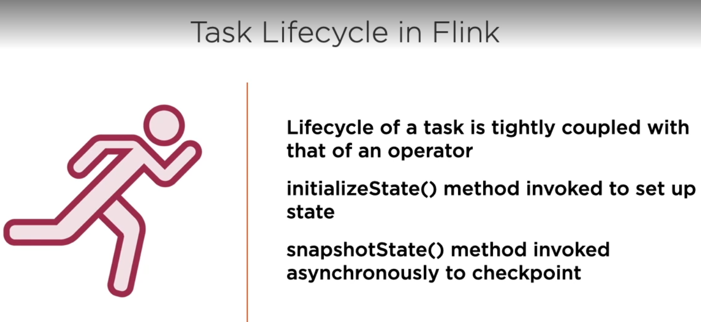
* The task is an instance of the operator, which means the lifecycle of a task is tightly coupled with the lifecycle of an operator
* Before a task can execute, the initializeState method is invoked to set up the initial state of the task before it's run
* SnapshotState method is invoked to asynchronously checkpoint the state of that particular task

  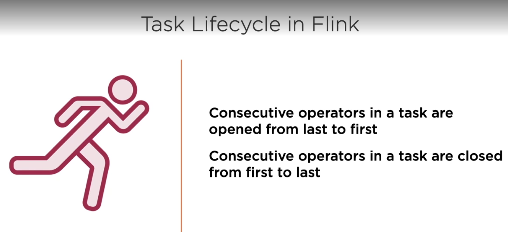

* Consecutive operators that are run within a task are open from last to first. 
* Consecutive operators in a task are closed from first to last.

# Flink Clusters and Deployment

  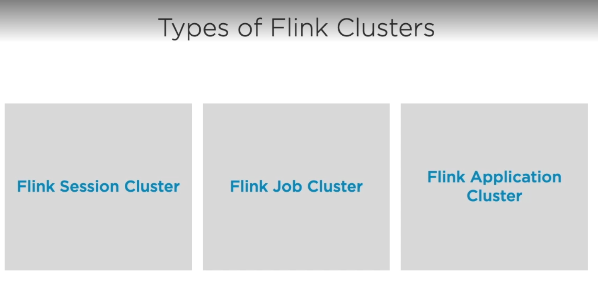

* There are three types off Flink clusters that you can set up
*  You can set up a Flink session cluster, a Flink job cluster or a Flink application cluster

  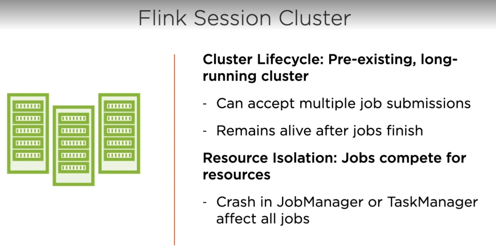

*  The session cluster is a long running, pre‑existing cluster
*  The cluster remains up and running and can accept multiple jobs submissions
*  The cluster continues to remain alive after the jobs have completed execution
*  The lifetime of a Flink session cluster is thus not bound to the lifetime of any particular Flink job
*  When you use a session cluster, TaskManager slots are allocated by the resource manager on job submission and released once the job is complete
*  Because all the jobs share the same cluster, the jobs will compete for resources
*  Also, if a JobManager or TaskManager crashes, all jobs using that JobManager or TaskManager will fail

  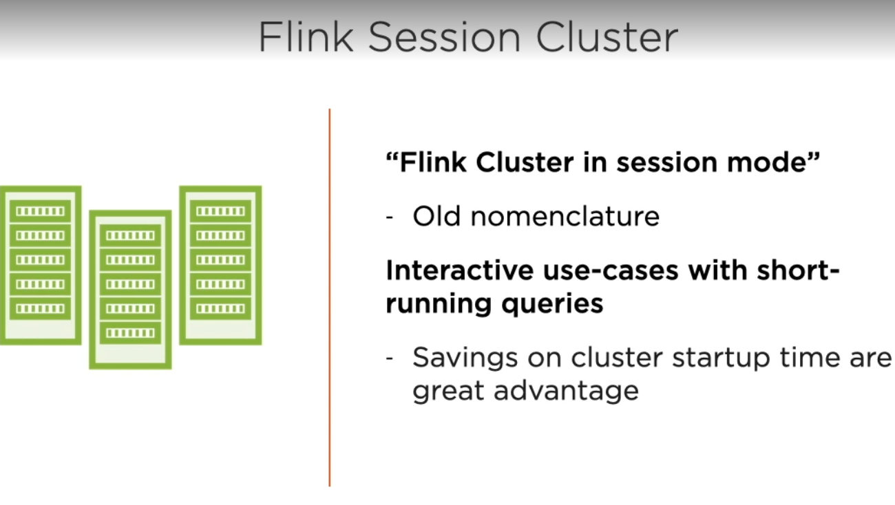

*  In previous versions of Flink, the Flink session cluster used to be called the Flink Cluster in session mode, so if you see references to this, it's the same thing as the Flink session cluster
*  The main use case for the Flink session cluster is to run interactive queries, which are short duration queries, short running queries
*  Having a pre‑existing cluster in such condition saves a considerable amount of time when you apply for resources and start TaskManagers
*  In the case of interactive short queries, it's important that jobs can quickly perform computations using existing resources
*  Resources don't have to be spun up explicitly for the job

  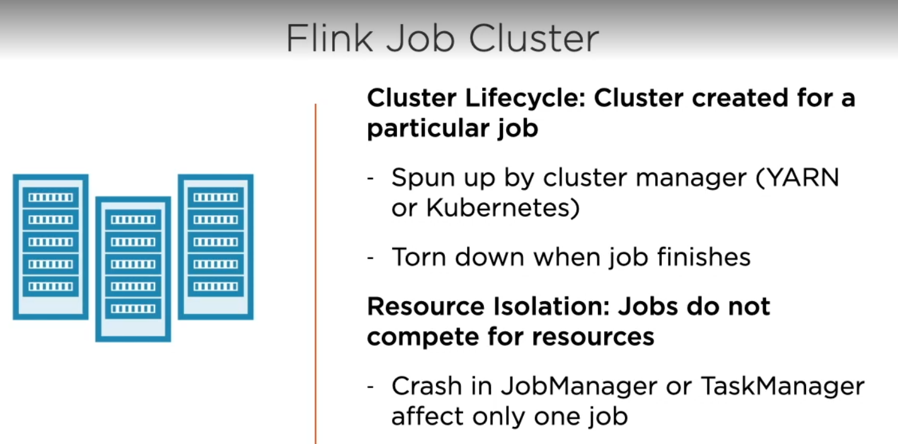

*  A Flink job cluster, as its name suggests, is a cluster that is specifically created for a particular job that you want to execute
*  This job cluster will be spun up by a cluster manager such as YARN or Kubernetes
*  Every submitted job will spin up a new instance of a Flink job cluster, and the entire cluster is then available for that job alone
*  All cluster resources are utilized by that one job
*  The cluster will be torn down once the job completes execution
*  A major advantage of the job cluster is that jobs running on this cluster are isolated from other jobs
*  A crash in the JobManager or TaskManager affects only the one job

  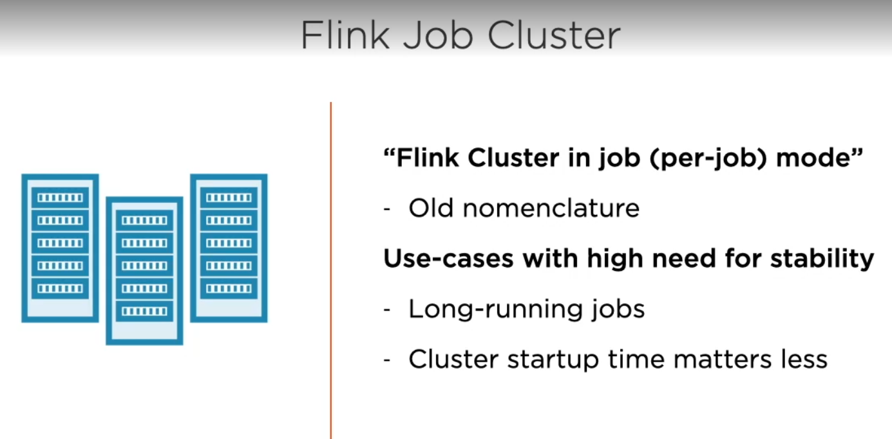

*  The Flink job cluster in earlier versions used to be referred to
*  as the Flink Cluster in job or per‑job mode
*  The main use case for the job cluster is for very long running jobs, where jobs can run for hours or even days
*  Such long running jobs have very high stability requirements and such jobs are typically not very sensitive to longer startup times
*  So even if it takes time to provision startup resources from scratch, that's totally fine

  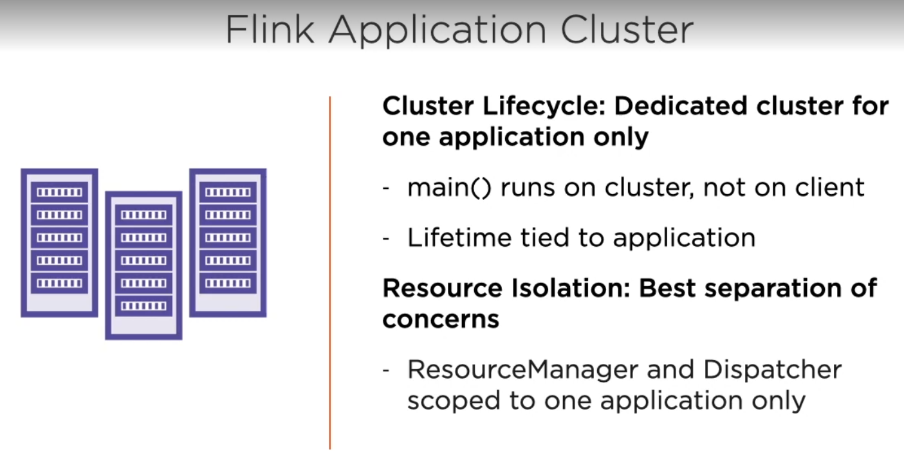

*  The third kind of Flink cluster is the Flink application cluster
*  Here you have a single cluster, a dedicated cluster for one Flink application that you need to execute
*  Here, the main entry point of your Flink code will not be executed on your client, rather, it will be executed on the cluster itself
*  The lifetime of the cluster is closely tied to the lifetime of the application
*  The cluster is no longer needed if the application doesn't run
*  In this case, the lifetime of the Flink application cluster is bound to the lifetime of the application
*  This cluster offers the best separation of concerns because all of the resources of the cluster are dedicated to a single application
*  The ResourceManager and the Dispatcher are scoped to the one application that runs on this cluster

  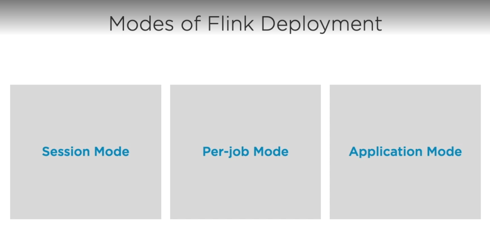

*  Corresponding to each type of cluster, Flink applications can be deployed in three different modes
*  In the session mode, the application assumes an already running cluster and uses the resources of the cluster to execute the job
*  Applications executed in the same session cluster compete for the same resources
*  A crashing application can affect other applications on that cluster
*  An alternative is to deploy a Flink application in the per‑job mode
*  This is aimed at providing better resource isolation guarantees
*  The per‑job more uses the available cluster manager framework, either YARN or Kubernetes, to spin up a separate cluster for every submitted job, and finally, Flink applications can be deployed in application mode, where we have a long running cluster specifically scoped to that application
*  The application mode creates a cluster per submitted application, but the main method of the application is executed on the JobManager of the cluster
*  Apache Flink comes with first class support for a number of common deployment targets

  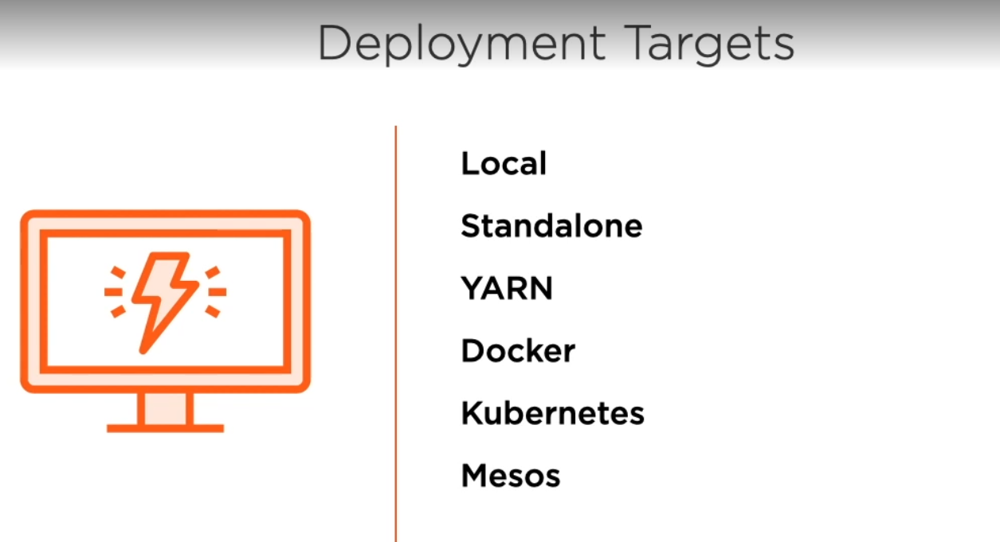

*  You can deploy locally, that is, run Flink locally for basic testing and experimentation
*  You can deploy Flink on a standalone cluster, on bare‑metal or virtual machines
*  You can deploy Flink on top of Apache Hadoop's resource manager, YARN
*  You can use Docker to run Flink within a containerized environment
*  You can use Kubernetes, which offers an automated system for deploying containerized applications, or you can use Mesos, a generic resource manager for running distributed systems

# Job Manager High Availability

  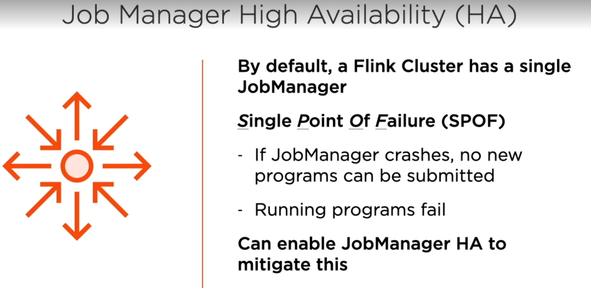

* A regular Flink cluster has exactly one JobManager and can have multiple TaskManagers
*  It's possible for you to configure the JobManager of a Flink cluster to work in high‑availability mode
*  Let's discuss how
*  The default configuration of a Flink cluster is to use a single JobManager
*  When you have just one JobManager, that becomes a single point of failure, or an SPOF
*  The JobManager is responsible for scheduling all your Flink applications on that cluster
*  So if the JobManager crashes, no new applications can be submitted
*  Any running program on the cluster will fail as well
*  You can configure your Flink cluster in high‑availability mode to mitigate this
*  In high‑availability mode, you will have more than one JobManager running

  

*  The high‑availability configuration for your JobManager will be a little different if you're working with a standalone cluster or if you're working with a YARN cluster
*  Let's talk about the standalone cluster first

  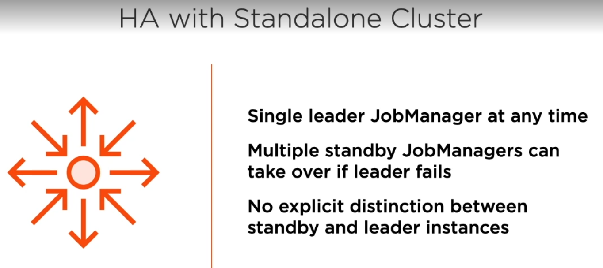

*  In a standalone cluster, which runs on bare metal machines or on virtual machines, you can have multiple JobManager processes running
*  Only one of these JobManagers will be the leader at any point in time
*  You can have multiple standby JobManagers, which can take over if the leader fails
*  So if for some reason the leader JobManager crashes, any of the other JobManagers can take on the leader role
*  There is no explicit distinction between standby JobManager instances and the leader JobManager instance

  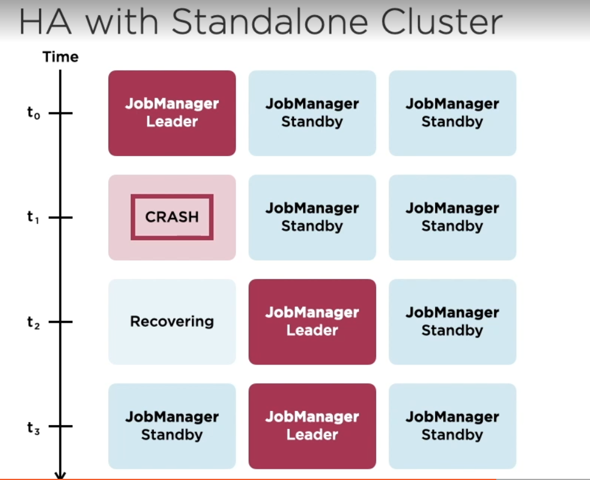

*  Imagine that you have a cluster with three JobManager instances configured
*  One of these JobManagers will be elected the leader
*  The cluster functions fine with one leader and multiple JobManager standbys
*  At some point, it's possible that the node on which the JobManager runs crashes
*  The JobManager leader no longer exists, which means one of the standby JobManagers have to take on the leader role
*  One of the JobManagers will be elected the leader while the original JobManager leader is recovering
*  Even after the original leader has completely recovered, the new leader continues to lead the cluster, and the recovered JobManager becomes the second standby

  

*  The high‑availability configuration mode in a standalone cluster requires the use of ZooKeeper
*  ZooKeeper is what we use to elect the leader JobManager
*  You need to configure the quorum for the ZooKeeper service so that the quorum can then elect a new leader if one is needed
*  You then set up your masters file with all of the JobManager hosts and their web UI ports

  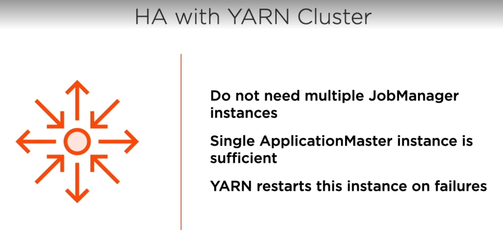

*  If you're running a high‑availability Apache Flink cluster using the YARN resource manager, you do not need to run multiple JobManager instances and elect one of them the leader
*  You just need a single ApplicationMaster instance, and that is enough
*  The YARN cluster manager will restart this instance in case of failures to ensure high availability

# Flink API

  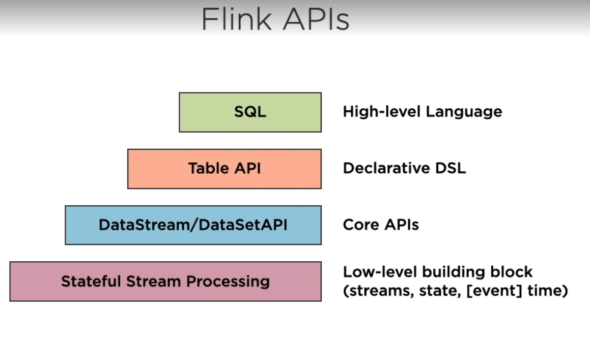

*  Flink actually offers a number of different APIs at different levels of abstraction
*  All of these APIs interact and integrate with one another very neatly, and you can mix and match these APIs to process your input stream

  

*  At the very lowest level, we have the APIs for stateful stream processing
*  This is the lowest level of abstraction, on top of which other high‑level APIs are built
*  This abstraction offers timely stream processing
*  This is basically stateful stream processing where time plays an important role
*  It is these APIs that offer the notion of event time and processing time of streaming entities
*  A discussion of event time and processing time is beyond the scope of this particular beginner course in Flink
*  Stateful stream processing API allows you to manage state and runtime context
*  These APIs provide consistent, fault‑tolerant state, allowing programs to realize very sophisticated computations

  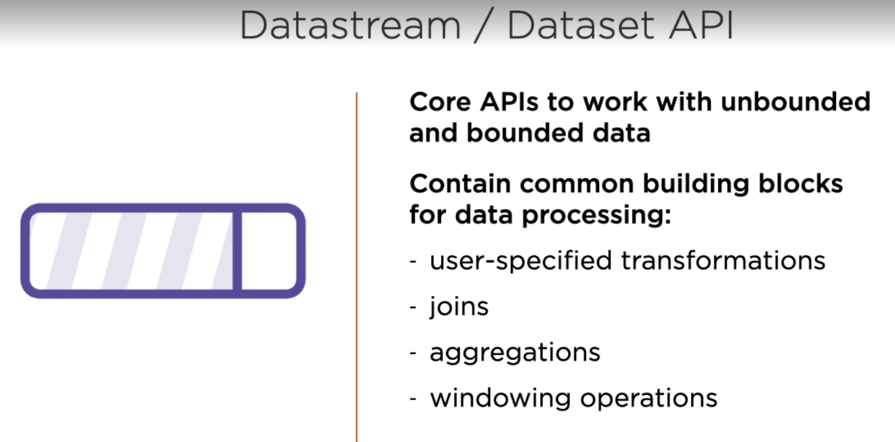

*  The data stream API that we've been working with so far is a higher level abstraction built on top of stateful stream processing functions
*  Data streams are used to work with streaming data
*  There is a corresponding dataset API that you can use to work with batch data for batch processing operations
*  These APIs are core APIs to work with both unbounded as well as bounded data
*  Both the data stream and dataset API contain common building blocks for data processing
*  Data stream and dataset APIs are what we would use to define user‑specified transformations on input data
*  These can be used to perform join operations on two or more streams
*  These can do be used to perform aggregation computations on input data, as well as perform windowing operations

  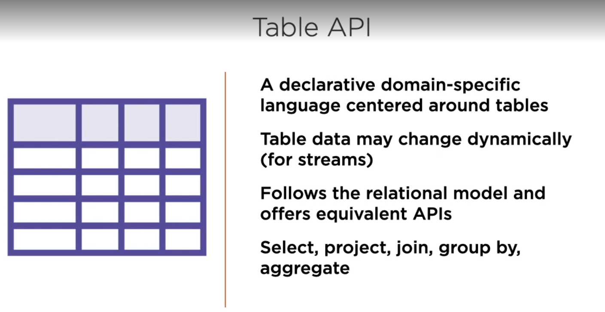

*  Flink also offers other higher‑level abstractions to process data
*  The table API is a declarative domain specific language centered around the concept of data stored in tables, that is relational data
*  Tables can be defined over batch data, as well as streaming data
*  Tables defined over streams are dynamic tables
*  That's because the contents of these tables can change dynamically
*  The table API follows the relational model of processing data
*  The APIs are intuitive, easy to use, and self‑explanatory
*  You can perform common table‑specific operations such as selection, projection, join operations, group‑by queries, and aggregations
*  The table APIs declaratively define what logical operation should be performed, rather than specifying exactly how the code for the operation looks
*  All programs using the table API go through an optimizer that applies optimization rules before execution

  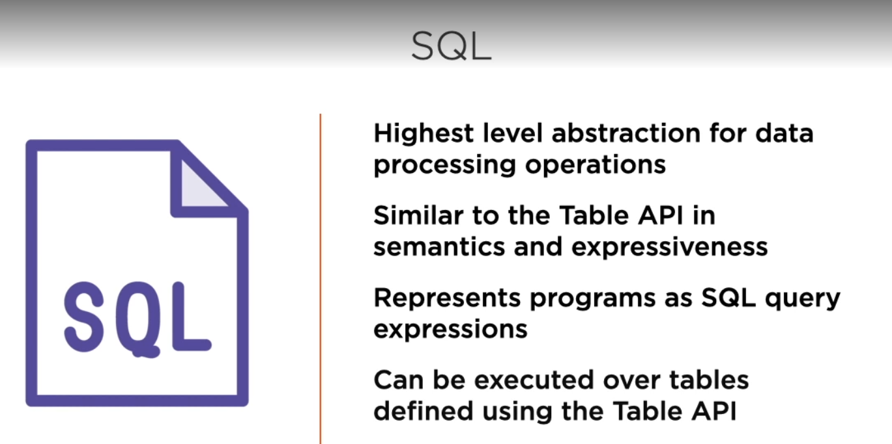

*  The highest level API for data processing operations is the use of SQL queries on your input streams
*  The operations that you can perform using SQL queries are the same operations that you can perform using the table API
*  So SQL is similar to the table API in semantics and expressiveness
*  But for the many developers who are familiar with using SQL queries to access and aggregate data, these APIs may prove to be more intuitive
*  With SQL queries, you represent programs as SQL query expressions
*  These expressions can then be executed over tables, which have been defined using the table API